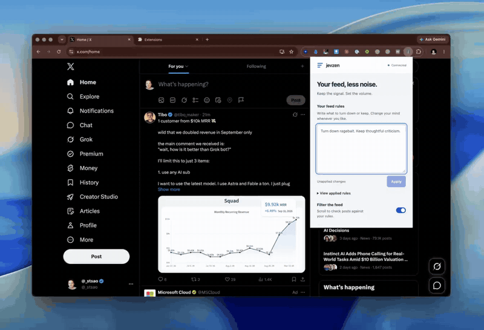

# jevzen

A small Chrome extension demo: describe what you want less of on X, then watch
matching posts crossfade into zen scenes or cat photos as you scroll. Posts keep
their original height, so the timeline stays in place. Reveal any post with one click.

Built with [TypeSafe Jev](https://docs.typesafe.ai/) and [Effect](https://effect.website/).
Bring your own API key. No hosted backend.

[](docs/demo/jevzen.mp4)

[Watch the 14-second demo](docs/demo/jevzen.mp4) · [Extension documentation](feed-analysis/README.md) · [MIT license](LICENSE)

## Try it

You need Node.js 22.9+ and pnpm 9.5.0 to build. No API key is needed for the build.

```sh
git clone https://github.com/steventsao/typesafe-effect-playground.git
cd typesafe-effect-playground/feed-analysis
pnpm install --frozen-lockfile
pnpm build
```

1. Open `chrome://extensions` and enable **Developer mode**.
2. Click **Load unpacked** and select `feed-analysis/dist` from this checkout.
3. Open **jevzen**, expand **Connection & privacy**, and save your provider key.
4. Refresh X, write your rules, click **Apply**, and scroll.

For example:

> Keep posts with demos and thoughtful criticism. Turn down ads, launch hype,
> and engagement bait.

Choose **Zen scenes** or **Cat photos** under **Replace with**. **Show original**,
**Undo last**, **Show all**, and pausing filtering restore the original posts.
There is no Chrome Web Store release; this demo is installed unpacked.

## What it does

- Checks text posts when they enter the viewport, with at most two pending requests per tab.
- Sends your rules and post text to Jev, then uses the returned probability to decide whether to switch the post.
- Crossfades matching posts to a bundled photo without removing or collapsing timeline cells.
- Lets you group loaded posts by topic or story, or use optional fading instead of photo replacement.
- Supports direct TypeSafe, OpenRouter Decisions, and Cloudflare Jev with your own credentials.

This is an experiment in giving readers more control over their feed. It can
misinterpret rules or miss posts. It does not analyze images, videos, or linked
pages, and X can change its page structure. API calls use your provider credits;
scrolling and grouping posts can incur charges. OpenRouter and Cloudflare adapters
have offline contract tests but have not been verified with funded live accounts.

## Privacy

Your rules and evaluated post text go to the selected provider. Provider retention
policies apply. The extension does not send DMs, cookies, or author metadata, and
never performs account actions such as muting, blocking, liking, or posting.

Keys stay in `chrome.storage.local`, restricted to trusted extension contexts.
They are not synced or shared with X. The extension caches hashed-text decisions
in session storage, not raw posts. Photos are bundled locally; loading one makes
no external image request. See [the extension guide](feed-analysis/README.md) for
data flow, provider setup, and validation limits.

## Development

The extension lives in `feed-analysis/`. Its optional synthetic feed lab builds
into `dev-dist/` and is excluded from the installed extension.

```sh
# From the repository root: original ticket example, offline checks.
pnpm install --frozen-lockfile
pnpm typecheck
pnpm test

# Extension checks, also offline.
pnpm --dir feed-analysis install --frozen-lockfile
pnpm --dir feed-analysis typecheck
pnpm --dir feed-analysis test
pnpm --dir feed-analysis build
pnpm --dir feed-analysis exec playwright install chromium
pnpm --dir feed-analysis test:browser
```

GitHub Actions runs typechecking, unit tests, the build, and the browser suite on
pushes and pull requests. Tests use synthetic posts and mocked provider responses;
no CI secrets or paid API calls are required. Effect packages are pinned to a
compatible v4 release candidate.

The original [support-ticket demo](docs/support-ticket-demo.md) remains at the
repository root. It demonstrates typed decisions, validation, retries, and a
Promise API over an Effect runtime.

## Contributing

Small fixes and experiments are welcome. See [CONTRIBUTING.md](CONTRIBUTING.md)
for local checks and the boundaries this demo keeps.

## Credits and license

Inspired by the scan/judge/act approach in
[realZachi/typesafe-adblock](https://github.com/realZachi/typesafe-adblock).
The four bundled photos were generated for this project; their prompts are in
[public/photos/PROMPTS.md](feed-analysis/public/photos/PROMPTS.md).

Original code, documentation, and generated photo assets are available under the
[MIT license](LICENSE). Dependencies retain their own licenses; extension builds
include `THIRD-PARTY-NOTICES.txt`. Third-party posts, branding, and interface content
visible in the demo recording remain the property of their respective owners and
are not relicensed by this project.
